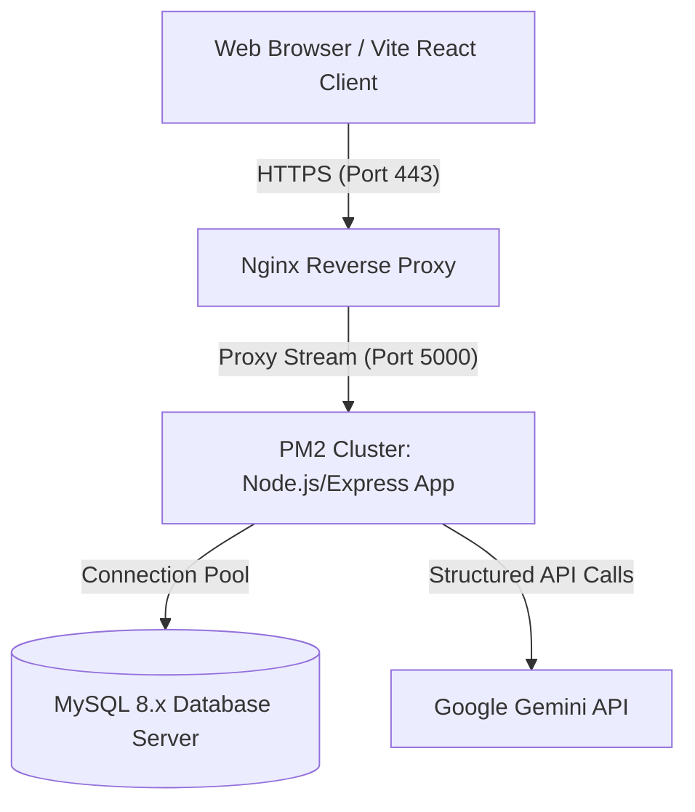

# Production Deployment & Systems Hardening Guide
## AI-Powered Loan Application Summary & Risk Assessment System

This guide outlines the production deployment architectures, server configurations, reverse proxy policies, and credentials-hardening procedures required to host the platform in a SOC2 and GLBA-compliant enterprise banking environment.

---

## 🏛️ System Architecture Layout



---

## 1. Environment Hardening (`.env`)

In production environments, never expose default debugging keys. Configure your `.env` parameters exactly as shown:

```ini
# Core Environment
PORT=5000
NODE_ENV=production

# MySQL Production Pool (Insulated on standard secure vNet)
DB_HOST=your-rds-instance.mysql.database.azure.com
DB_PORT=3306
DB_USER=compliance_backend_user
DB_PASSWORD=your_super_strong_production_password_here
DB_NAME=loan_assessment_db

# Cryptographic Keys (Use 256-bit high-entropy keys)
# Generate via: node -e "console.log(require('crypto').randomBytes(32).toString('hex'))"
JWT_SECRET=8f45a278d6b5e0c52a0bf2c03164fa85c21f92e3410651aef01bc89a081512db
JWT_EXPIRES_IN=12h

# Generative AI Security Clearance
GEMINI_API_KEY=AIzaSyYourProductionGeminiKeyHere
```

> [!CAUTION]
> Ensure `.env` is registered inside `.gitignore`. Never check credentials, keys, or passwords directly into Git version control.

---

## 2. PM2 Daemon Process Clustering

To leverage multi-core CPUs and guarantee zero-downtime hot reloads, run the Node.js server using **PM2** in cluster mode:

### PM2 Configuration (`ecosystem.config.json`)
Create `ecosystem.config.json` in your backend root directory:

```json
{
  "apps": [
    {
      "name": "loan-assessment-api",
      "script": "src/index.js",
      "instances": "max",
      "exec_mode": "cluster",
      "env": {
        "NODE_ENV": "production"
      },
      "watch": false,
      "max_memory_restart": "1G",
      "error_file": "logs/pm2_error.log",
      "out_file": "logs/pm2_combined.log",
      "log_date_format": "YYYY-MM-DD HH:mm:ss"
    }
  ]
}
```

### PM2 Execution Commands
* **Start Clustering**: `pm2 start ecosystem.config.json`
* **Zero-Downtime Reload**: `pm2 reload all` (reloads files sequentially keeping server active!)
* **List Active Processes**: `pm2 list`
* **Realtime Metrics Dashboard**: `pm2 monit`
* **Configure Startup Daemon on OS Reboot**: `pm2 startup` followed by `pm2 save`

---

## 3. Nginx Reverse Proxy Configuration

Nginx acts as a reverse proxy protecting Node.js ports from external scanners while handling SSL decryption and client IP forwarding.

### Standard Configuration File (`/etc/nginx/sites-available/bank-loan-api`)

```nginx
# Upstream clusters mapping
upstream loan_backend {
    server 127.0.0.1:5000;
    keepalive 32;
}

# Redirect HTTP to secure HTTPS
server {
    listen 80;
    listen [::]:80;
    server_name api.loan-underwrite.bank.com;
    return 301 https://$server_name$request_uri;
}

# Secure HTTPS Server Block
server {
    listen 443 ssl http2;
    listen [::]:443 ssl http2;
    server_name api.loan-underwrite.bank.com;

    # SSL Certs Path (Using high-grade TLS 1.3 only)
    ssl_certificate /etc/letsencrypt/live/api.loan-underwrite.bank.com/fullchain.pem;
    ssl_certificate_key /etc/letsencrypt/live/api.loan-underwrite.bank.com/privkey.pem;
    ssl_protocols TLSv1.2 TLSv1.3;
    ssl_ciphers 'ECDHE-ECDSA-AES256-GCM-SHA384:ECDHE-RSA-AES256-GCM-SHA384';
    ssl_prefer_server_ciphers on;

    # Security Headers Override (Helmet supplemental)
    add_header X-Frame-Options "DENY" always;
    add_header X-Content-Type-Options "nosniff" always;
    add_header Referrer-Policy "strict-origin-when-cross-origin" always;
    add_header Content-Security-Policy "default-src 'self'; frame-ancestors 'none';" always;
    add_header Strict-Transport-Security "max-age=63072000; includeSubDomains; preload" always;

    # Gzip Compression Setup
    gzip on;
    gzip_types text/plain application/json application/javascript text/css;
    gzip_min_length 1000;

    # Request Routing Context
    location / {
        proxy_pass http://loan_backend;
        proxy_http_version 1.1;
        
        # Keepalive headers
        proxy_set_header Connection "";
        
        # Client IP forwarding headers (required for our rate-limiting & audit loggers!)
        proxy_set_header Host $host;
        proxy_set_header X-Real-IP $remote_addr;
        proxy_set_header X-Forwarded-For $proxy_add_x_forwarded_for;
        proxy_set_header X-Forwarded-Proto $scheme;

        # Buffers tuning
        proxy_buffers 8 16k;
        proxy_buffer_size 32k;
        proxy_read_timeout 60s;
        proxy_connect_timeout 60s;
    }
}
```

---

## 4. Production Database Migrations & Tuning

### Database Schema Updates
To run database schema updates in production safely:
1. Back up current tables:
   ```bash
   mysqldump -u compliance_backend_user -p loan_assessment_db > backup_underwriting_$(date +%F).sql
   ```
2. In production, never drop active tables (`DROP TABLE IF EXISTS`). Apply migrations surgically using explicit `ALTER TABLE` operations or managed migration frameworks.

### Index Optimization
To support fast dashboard aggregates and audit logging searches under heavy load, index critical query parameters:

```sql
USE `loan_assessment_db`;

-- Accelerate Officer portfolio reads and pagination boundaries
CREATE INDEX idx_applicants_created_by ON applicants(created_by);
CREATE INDEX idx_applicants_status ON applicants(status);

-- Accelerate SSN verification lookups (KYC / Fraud detection velocity)
CREATE INDEX idx_applicants_ssn ON applicants(ssn);

-- Accelerate Audit Inspector queries
CREATE INDEX idx_audit_logs_action ON audit_logs(action);
CREATE INDEX idx_audit_logs_user_id ON audit_logs(user_id);
CREATE INDEX idx_audit_logs_created_at ON audit_logs(created_at);
```

---

## 5. Security & Logs Auditing Maintenance

1. **Rotated Logs Archival**: Winston generates rolling logs inside `backend/logs/combined.log` and `error.log`. Implement standard OS `logrotate` to compress and move these weekly logs to immutable read-only storage (like AWS S3 with Object Lock or GCP Cloud Storage Vaults) to secure them from deletion.
2. **Access Audits**: Instruct administrators to regularly query `/api/audit-logs` or export JSON logs to security information and event management (SIEM) systems (like Splunk or Datadog) to alert on high-velocity unauthorized access attempts (`DOWNLOAD_REPORT_BLOCKED`, `READ_APPLICANT_BLOCKED`).
